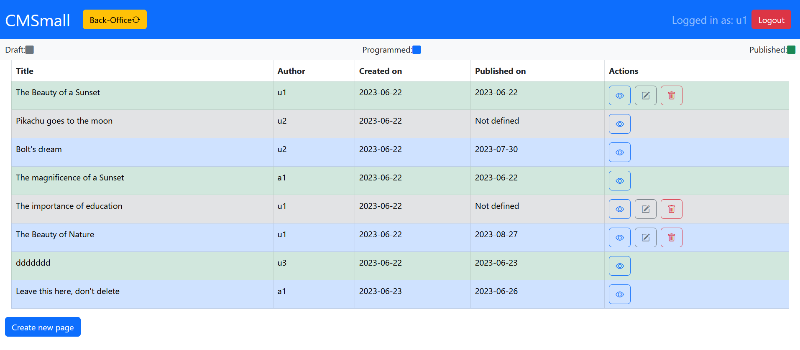
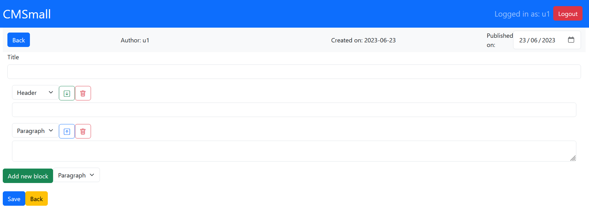

# Exam #1: "CMSmall"
## Student: Dente Francesco 
## Commands to test the web application locally
- git clone ...
- cd "projectDir"
- git pull origin main # just in case the default branch is not main
- (cd client ; npm install)
- (cd server ; npm install)

## React Client Application Routes

- Route `/`: Main page, contains the list of pages, the form to create a new page and the form to update the sitename (if admin). 
- Route `/login`: Login page, contains the form to login.
- Route `/pages/view/:page_id`: Route to view a page, read only.
- Route `/pages/edit/:page_id`: Route to edit a page, only if the user is the author of the page, or admin.
- Route `/pages/add`: Route to add a new page, only if the user is authenticated.
- Route `/*`: 404 page.

## API Server

### __Get pages__

URL: `/api/pages`

Method: GET

Description: Get all pages. A cookie with a VALID SESSION ID must be provided.

Request body: _None_

Response: `200 OK` (success) , `401 Unauthorized` in case of non authenticated session,`500 Internal Server Error` (error)

Response body: An array of objects, each describing a page
```
[
  {
    "page_id": 1,
    "author_id": 1,
    "author_name": "John Doe",
    "title": "Page title",
    "creation_date": "2020-01-01T00:00:00.000Z",
    "publication_date": "2020-01-01T00:00:00.000Z",
  },
  ....
]
```

### __Get published pages__

URL: `/api/pages/published`

Method: GET

Description: Get all published pages

Request body: _None_

Response: `200 OK` (success) or `500 Internal Server Error` (error)

Response body: An array of objects, each describing a page
```
[
  {
    "page_id": 1,
    "author_id": 1,
    "author_name": "John Doe",
    "title": "Page title",
    "publication_date": "2020-01-01T00:00:00.000Z",
    "creation_date": "2020-01-01T00:00:00.000Z",
  },
  ....
]
```

### __Get page (by Id)__

URL: `/api/pages/:page_id`

Method: GET

Description: Get page along with its content based on given id. Different behaviour based on authentication or not. Non-authenticated users can only get
published pages.

Request body: _None_

Response: `200 OK` (success), `404 page not found` or `500 Internal Server Error` (error)

Response body: An object describing the page

```
{
  "page_id": 1,
  "author_id": 1,
  "author_name": "John Doe",
  "title": "Page title",
  "creation_date": "2020-01-01T00:00:00.000Z",
  "publication_date": "2020-01-01T00:00:00.000Z",
  "blocks": [{block_id: 1, block_type: "header", content:"content", position: 1}, {...}, ...],
}
```

### __Get images__
URL: `/api/images`

Method: GET

Description: Get all images urls available. A cookie with a VALID SESSION ID must be provided.

Request body: _None_

Response: `200 OK` (success) , `401 Unauthorized` in case of non authenticated session,`500 Internal Server Error` (error)

Response body: An array of objects, each describing an image
```
[
  {
    "image_id": 1,
    "image_name": "test",
    "image_path": "http://localhost:3001/static/images/test.jpg",
  },
  ....
]
```

### __Get sitename__
URL: `/api/sitename`

Method: GET

Description: Get the sitename.

Request body: _None_

Response body: An object describing the sitename
```
{
  "site_name": "My sitename"
}
```

Response: `200 OK` (success) , `500 Internal Server Error` (error)

### __Update sitename__
URL: `/api/sitename`

Method: PUT

Description: Update the sitename. A cookie with a VALID SESSION ID must be provided.

Only admins can update the sitename.

Request body: An object representing the sitename (Content-Type: `application/json`).
```
{
  "site_name": "My new sitename"
}
```

Response body: _None_

Response: `200 OK` (success) or `503 Service Unavailable` (generic error). If the request body is not valid, `422 Unprocessable Entity` (validation error). If the request does not come on an admin authenticated session, `401 Unauthorized`.


### __Create page__
URL: `/api/pages`

Method: POST

Description: create a new page. A cookie with a VALID SESSION ID must be provided. If called by an admin, a valid author_id (corresponding to an existing user) different from the user id of the session can be provided.

If the requesting user tries to create a page associated to another user, the request is rejected.

If the requesting admin tries to create a page associated to a non-existing user, the request is rejected.

Request body: An object representing the page (Content-Type: `application/json`).
```
{
    "title": "Page 1",
    "publication_date": "2020-03-02",
    "author_id": 1,
    "blocks": [{block_type: "header", content:"content", position: 1}, {block_type: "paragraph", content:"content", position: 2}],
}
```

Response: `201 Created` (success) or `503 Service Unavailable` (generic error). If the request body is not valid, `422 Unprocessable Entity` (validation error).If the request does not come on an authenticated session, `401 Unauthorized`.

Response body: _None_

### __Update page (by Id)__
URL: `/api/pages/:page_id`

Method: PUT

Description: update entirely an existing page, identified by its id. It first updates the page and delete all the blocks associated with it and then creates new ones based on the request body. A cookie with a VALID SESSION ID must be provided. 

If the requesting user is not the author of the page, or is trying to update also the author of the page, the request is rejected.

If the requesting user is an admin, then he is allowed both to update every page and to change the author of the page. (a author_id corresponding to a valid user must be provided)

Request body: An object representing the page (Content-Type: `application/json`).
```
{
    "page_id": 1,
    "author_id": 1,
    "title": "Page 1",
    "publication_date": "2020-03-02",
    "blocks": [{block_type: "header", content:"content", position: 1}],
}
```

Response: `200 OK` (success) or `503 Service Unavailable` (generic error). If the request body is not valid, `422 Unprocessable Entity` (validation error).`404 Not found` If the page to update is not found. If the request does not come on an authenticated session, `401 Unauthorized`.

Response body: _None_

### __Delete page (by Id)__
URL: `/api/pages/:page_id`

Method: DELETE

Description: delete an existing page identified by its id, and its corresponding blocks. A cookie with a VALID SESSION ID must be provided.

The user requesting the deletion the answer must be the same that owns the page or an admin.

Request body: _None_

Response: `204 No Content` (success) or `503 Service Unavailable` (generic error). If the request does not come on an authenticated session, `401 Unauthorized`.

Response body: _None_

### __Get users__
URL: `/api/users`

Method: GET

Description: get all users. A cookie with a VALID SESSION ID must be provided. The user requesting the list of users must be an admin.

Request body: _None_

Response: `200 OK` (success) or `500 Internal Server Error` (generic error). If the request does not come on an authenticated session, `401 Unauthorized`.

Response body:
```
[
  {
    "id": 1,
    "name": "u1"
  },
  {
    ..
  },...
]
```
### __Create a new session (login)__

URL: `/api/sessions`

HTTP Method: POST

Description: Create a new session starting from given credentials.

Request body:
```
{
  "username": "harry@test.com",
  "password": "pwd"
}
```

Response: `200 OK` (success) , `401 Unauthorized` (incorrect credentials), `500 Internal Server Error` (generic error).

Response body: _None_


### __Get the current session if existing__

URL: `/api/sessions/current`

HTTP Method: GET

Description: Verify if the given session is still valid and return the info about the logged-in user. A cookie with a VALID SESSION ID must be provided to get the info of the user authenticated in the current session.

Request body: _None_ 

Response: `201 Created` (success) or `401 Unauthorized` (error).

Response body (`201`):
```
{
  "username": "harry@test.com",
  "id": 4,
  "name": "Harry"
}
```
Response body (`401`):
```
{
  "error": "Unauthenticated user!"
}
```

### __Destroy the current session (logout)__

URL: `/api/sessions/current`

HTTP Method: DELETE

Description: Delete the current session. A cookie with a VALID SESSION ID must be provided.

Request body: _None_

Response: `200 OK` (success) or `500 Internal Server Error` (generic error).

Response body: _None_


## Database Tables

Table `users` - users (`id`, `email`, `name`, `admin`, `salt`, `hash`)
- `admin`: boolean, `hash`: hashed password using salt

Table `pages` - pages (`page_id`, `author_id`, `title`, `creation_date`, `publication_date`)
- `creation_date`: automatically generated by the server
- `publication_date`: can be null, to indicate absence of publication

Table `blocks` - blocks (`block_id`, `page_id`, `block_type`, `content`, `position`)
- `page_id`: key used to join blocks with corresponding pages. (Foreign key in the application logic)
- `block_type`: can be `header`, `paragraph`, `image`
- `position`: integer to indicate position of block inside the page. (zero-indexed)
- `content`: content text for `header` and `paragraph`, image url for `image`

Table `sites` - sites (`site_id`, `site_name`)

Table `images` - images (`image_id`, `image_name`, `image_url`)

## Main React Components

- `App`: component that manages the routing of the application. It contains the main states for the application.

- `PagesRoute` (in `PagesRoute.jsx`): component in route "/", it wraps the `MainPages` component and is responsible for rendering the NavHeader, the button for changing from backOffice to frontOffice and for creating a new page, the form for changing sitename. It is also responsible for rendering `Alert` component for showing generic errors that should not happen if the application is working properly.

- `MainPages` (in `PagesRoute.jsx`): component that only renders the list of pages using the `PageRow` component

- `PageRow` (in `PagesRoute.jsx`): component that renders a single row of the list of pages. Its main feature is rendering correct action buttons based on current session.

- `PageEdit` (in `PageComponents.jsx`): component that renders the form for editing/adding a page. It manages all the logic related to changing the layout of a page (adding/removing blocks, changing their position, content, or type, changing page properties). It's all made locally on the client, information is sent to the server only when clicking `save` button. It renders a list of `BlockEdit` components, that are responsible for rendering the single editable block 

- `PageView` (in `PageComponents.jsx`): component that renders a page only in view mode. It renders a list of `BlockView` components, that are responsible for rendering the single block.

- `NavHeader` (in `NavbarComponents.jsx`): component that renders the navbar, present in every page of the application, it renders different buttons based on current session or route.

- `LoginForm` (in `AuthComponents.jsx`): component that renders the form for login

## Screenshot




## Users Credentials

- username: u1@e.com, password: "pwd", admin: false
- username: u2@e.com, password: "pwd", admin: false 
- username: u3@e.com, password: "pwd", admin: false 
- username: a1@e.com, password: "pwd", admin: true


